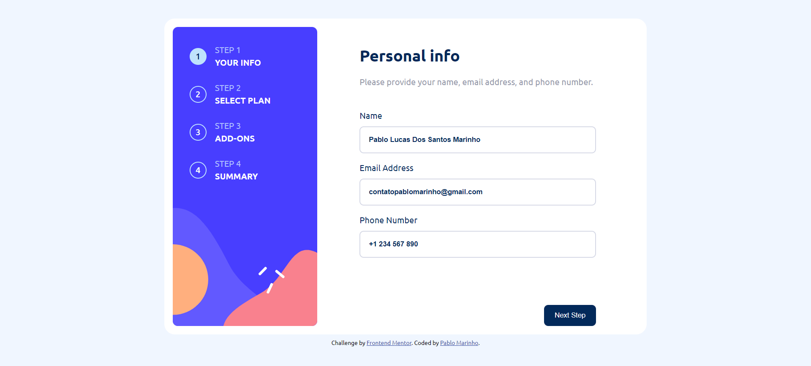

# Frontend Mentor - Multi-step form solution

This is a solution to the [Multi-step form challenge on Frontend Mentor](https://www.frontendmentor.io/challenges/multistep-form-YVAnSdqQBJ). Frontend Mentor challenges help you improve your coding skills by building realistic projects.

## Table of contents

- [Overview](#overview)
  - [The challenge](#the-challenge)
  - [Screenshot](#screenshot)
  - [Links](#links)
- [My process](#my-process)
  - [Built with](#built-with)
  - [What I learned](#what-i-learned)
  - [Continued development](#continued-development)
  - [Useful resources](#useful-resources)
- [Author](#author)

## Overview

### The challenge

Users should be able to:

- Complete each step of the sequence
- Go back to a previous step to update their selections
- See a summary of their selections on the final step and confirm their order
- View the optimal layout for the interface depending on their device's screen size
- See hover and focus states for all interactive elements on the page
- Receive form validation messages if:
  - A field has been missed
  - The email address is not formatted correctly
  - A step is submitted, but no selection has been made

### Screenshot

.png>)
.png>)
.png>)
.png>)
.png>)
.png>)
.png>)

### Links

- Solution URL: [My solution in Frontend Mentor](https://www.frontendmentor.io/solutions/multi-step-form-with-vuejs-2q-N7m7s1L)
- Live Site URL: [GitHub Pages](https://pablolucasmarinho.github.io/multi-step-form-vue/)

## My process

### Built with

- Semantic HTML5 markup
- CSS custom properties
- Flexbox
- CSS Grid
- [VueJs](https://vuejs.org/) - JS library

### What I learned

I experimented a lot with this project and learned a little more about VueJs, especially about the watch Option, which is what I used to make the step indicators activated or deactivated according to the step we are in.

### Continued development

I want to continue working with forms using VueJs, I found it very practical for working with data in this Framework.

### Useful resources

- [Watchers](https://vuejs.org/guide/essentials/watchers.html) - This helped me make the dots that indicate which stage of the form we are in, stay active in the correct stage.
- [Reactivity API](https://vuejs.org/guide/scaling-up/state-management.html#simple-state-management-with-reactivity-api) - This helped me store global states in my application, so that I had somewhere to store the step data and which step we are currently at.

## Author

- GitHub - [PabloLucasMarinho](https://github.com/PabloLucasMarinho)
- Frontend Mentor - [@PabloLucasMarinho](https://www.frontendmentor.io/profile/PabloLucasMarinho)
